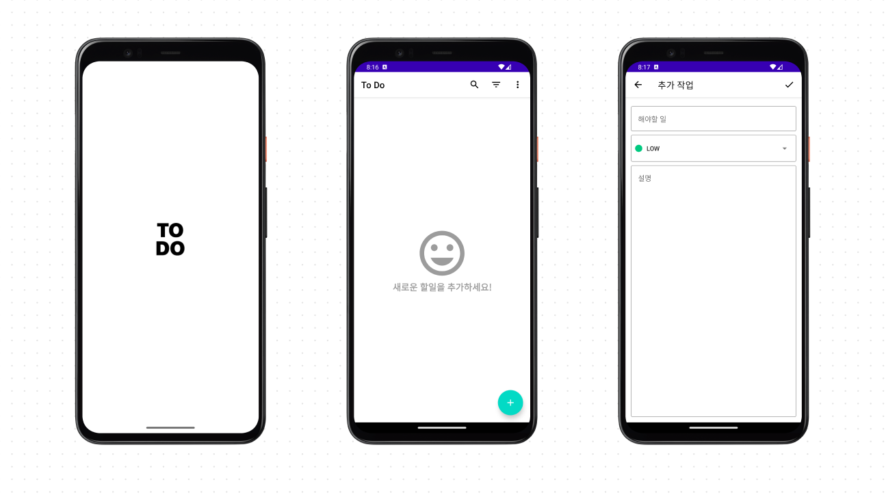

# ToDo Sample

ToDo is a planning app part of Material Design built with Jetpack Compose.

This sample showcase:

* Material components & Light/dark themes
* UI state handling
* Animation

## Screenshots


## Features

This sample contains 3 screens:

* `SplashScreen.kt` is the first graphical notification you receive when you visit this sample
* `ListScreen.kt` that you can search for added tasks, delete all, and sort by importance
* `TaskScreen.kt` that you can add tasks to be done in three categories: title, importance, description

### Architecture Components

The `Navigation.kt` shows how to pass data between Compose with the Navigation component and observe
state from a shareViewModel, served via Flow.

## Hilt

ToDo adds a dependency to use Hilt. @HiltViewModel annotation works with `viewModel()` function Hilt
creates a ViewModel for `viewModel()` to use automatically.

```kotlin
@HiltViewModel
class SharedViewModel @Inject constructor(
    private val repository: ToDoRepository,
) : ViewModel() {}
```

## Data

The data in the sample is static, held in the `com.example.todo.data` package.